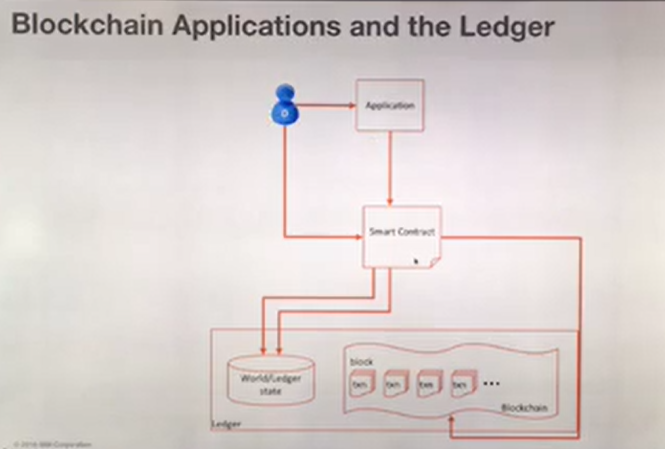

# Blockchain #

## Blockchain คืออะไร ##

- Ledgers คืออะไร -> สมุดบัญชี หรือ database โดยมีสิ่งที่บันทึก ดังนี้
  - Participants บอกว่า transactions นั้นๆ ใครทำกับใคร อาจมีเกิน 2 parties ได้ เช่น สัญญากู้เงิน
  - Transactions สิ่งที่กำลังจะแลกเปลี่ยน
  - Contracts สัญญา ในการแลกเปลี่ยนจะต้องมีสญญาเสมอ เช่น ซื้อลูกชิ้นต้องจ่ายเงินให้แม่ค้า 5 บาท แม่ค้าต้องให้ลูกชิ้น 1 ไม้

- ปัญหาในปัจจุบัน เช่น เวบขายของ มันจะต้องไปเกี่ยวข้องกับหลาย parties เช่น ธนาคาร เจ้าของสินค้า ซึ่งต่างคน ต่างเก็บ transactions ของตัวเองแยกกัน ต้องมานั่งทำระบบ integrations ส่งข้อมูลหากัน ลงทุนเยอะ เสี่ยงข้อมูลรั่วไหลได้ เช่น เวบขายของต้องเก็บข้อมูลบัตรเครดิตไว้เองด้วย

- จึงเกิด concept ใหม่ขึ้นมาชื่อว่า shared ledger technology คือ แทนที่ต่างคนต่างเก็บ transactions อยู่กับตัว แล้วพยายามมา integrate เข้าหากัน ก็เอามาเขียนไว้ใน ledger หรือสมุดบัญชีเล่มเดียวกันแทนเลย เพื่อให้เห็นเป็นภาพเดียวกัน

## Blockchain for Business ##
- จะเป็นการเทรดของที่มีอยู่แล้ว และเทรดในรูปแบบของ private market คือแต่ละคนต้องรู้จักกัน ประกอบด้วย
  - Shared Ledger คือ ทุกๆ คน มาเขียนข้อมูลไว้ที่เดียวกัน ซึ่งทุกๆ transacations จะถูก encryp ไว้ ดังนั้นแต่ละคนจะเห็นข้อมูล transactions ไม่เท่ากัน จะมีสิทธิดูได้เท่าที่ตัวเองมีสิทธิเท่านั้น
  - Smart Contract คือ สามารถสร้างสัญญาลงไปใน blockchain ได้เลย ซึ่งจะถูก deploy ไปในทุกๆ node 
  - Privacy คือ การจัดการเรื่อง identity คือแต่ละคนต้องรู้จักกัน มีการกำหนดสิทธิการเข้าถึง transactions ของแต่ละคน
  - Consensus เนื่องจาก blockchain นั้นจะไม่มีใครเป็นเจ้าของจริงๆ ดังนั้นเมื่อจะมีการเชียนข้อมูลลงไปใน blockchain เราจะต้องให้หลายๆ คน มาช่วยกัน verify ก่อนว่าข้อมูลนั้นถูกต้อง จึงจะเขียนข้อมูลลงไปได้ เช่น ถ้ามีทั้งหมด 5 parties แล้วมีการเขียนข้อมูลลงมา เราขอให้อย่างน้อย 3 parties มาช่วยกันยืนยัน ถ้าถูกต้องจึงเขียนลงไปได้ ง่ายๆ ก็คือ การมาช่วยกันดูแล blockchain ของเราว่าข้อมูลที่เขียนลงไปนั้นเป็นข้อมูลที่ถูกต้องแล้วจริงๆ

- ประโยชน์ที่ได้
  - ลด cost และความซับซ้อนของระบบที่จะมา integrate กัน
  - ตัดปัญหาเรื่องข้อมูลไม่ตรงกันในแต่ละที่ ถ้าไม่ตรงกันต้องมาดูอีกว่าของใครถูก แต่ใน blockchain ข้อมูลที่เขียนลงไปผ่านการ consensus มาแล้วเชื่อถือได้เลย
  - การเข้าถึงข้อมูลสามารถเข้าถึงได้เลย เพราะทุกๆ ที่เป็น node อยู่แล้ว และทุกๆ node มีข้อมูลเหมือนกัน และการเพิ่ม party ใหม่เข้ามา ก็แค่ไป deploy node ใหม่ ก็ใช้งานได้เลย
  - ใช้ smart contract เป็นคุมสัญญา คุม process ทำให้ระบบเป็นตัวคอย monitor ให้ทั้งหมด

  ## Hyperledger Project ##
  - private, permission

  

  - Hyperledger Fabric 1.0 มีการปรับ consensus ใหม่
    - Submitter: คือ non-validating peer มีหน้าที่รับ request เพื่อ submit transaction เข้าไปใน blockchain
    - Endorser: เป็น peer ที่ถือ smart contact โดยจะเอา transactions ที่รับเข้ามาแล้วลองรัน smart contact แล้วดูว่าได้ลัพธ์ว่าอะไร (Simulated result)
    - Orderer: เนื่องจากใน 1 sec อาจมีเข้ามาพร้อมๆ กัน หลายๆ transactions ตัว orderer จะเป็นตัวรวม transaction เข้ามาเป็น block แล้วส่งต่อให้ committer
    - Committer: verify ว่า block ถูกต้องมี consensus ถูกต้อง แล้วก็จะเขียน block ลงไปใน blockchain

    - เทียบกับ v 0.6 (ทำได้แค่ 15 transactions/sec)
      - Submitter = Non Validating Peer
      - Endorser, Orderer and Committer = Validating Peer