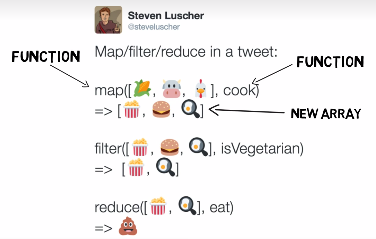

## Functional Programming ##
คือ วิธีการเขียนโค้ดรูปแบบหนึ่ง โดยหัวใจของมันคือการที่มันจะไม่ได้เปลี่ยนแปลงสถานะ หรือค่าของตัวแปร และจะเป็นแบบ Declarative Style คือต้องการให้โปรแกรมของเราได้ผลลัพธ์ออกมาเป็นยังไง ไม่ใช่การเขียนโค้ดยังไงให้ได้ผลลัพธ์ตามที่เราต้องการแบบ Imperative Style

**คุณสมบัติของ Functional Programming**
- **Immutability** คือ จะไม่มีการไปเปลี่ยนแปลงค่าของตัวแปร เช่น `array.concat()` กับ `array.slice()`
```javascript
const nums1 =[1, 2, 3];
const nums2 = [6, 7];

nums.concat(4); // [1, 2, 3, 4]
nums.slice(0, 2); // [1, 2]

// หรือใช้ Spread Operator มาสร้าง array หรือ object ใหม่ก็ได้
let newArr = [...nums1, 4, 5, ...nums2]; // [1, 2, 3, 4, 5, 6, 7]
```
- **Higher order function** คือฟังก์ชันที่สามารถรับพารามิเตอร์เป็นฟังก์ชันได้ หรือจะรีเทิร์นออกไปเป็นฟังก์ชันก็ได้
```javascript
function log(level){
    return function(message){
        console.log(`${level}: ${message}`);
    }
}

/* 
// หรือเขียนแบบ arrow function
const log = (level) => (message) => {
    console.log(`${level}: ${message}`);
};
// หรือพารามิเตอร์ตัวเดียวไม่ต้องใส่วงเล็บ
const log = level => message => console.log(`${level}: ${message}`);
*/
const debugLevel = log('DEBUG');
debugLevel('Test'); // DEBUG: Test
```
- **Pure Function** ส่ง input เหมือนเดิม ต้องได้ output เหมือนเดิมเสมอ เช่น Map/Filter/Reduce (ตัวอย่างฟังก์ชันที่ input เดียวกัน แต่ได้คนละ output เช่น math.random() เรียกว่า impure function)
- **Data Transformations** คือการสร้างข้อมูลชุดใหม่ ออกมาจากข้อมูลชุดเดิม โดยที่ข้อมูลชุดเดิมไม่มีการเปลี่ยนแปลง



- `array.filter()`
```javascript
let testScores = [92, 87, 54, 63, 75, 59];
const passingTestFunc = function (test){
    return test > 60;
}
var graduations = testScores.filter(passingTestFunc);
console.log(graduation); // [92, 87, 63, 75]

// หรือเขียนสั้นๆ
var graduations = testScores.filter((test) => {
    return test > 60;
});
console.log(graduation); // [92, 87, 63, 75]
```
- `array.map()` สร้างอาร์เรย์ใหม่ออกมาเป็นผลลัพธ์ จากการเรียกใช้งานฟังก์ชันที่เตรียมไว้ทีละ element ของ input อาร์เรย์ โดยที่ไม่มีการไปเปลี่ยนแปลงค่าใน input เลย
```javascript
// ถ้าต้องการคูณตัวเลขในอาร์เรย์นี้ทุกตัวด้วย 3
let numbers = [1, 3, 5, 7, 9];

// ถ้าใช้ for loop
var results = [];
for(var i = 0; i < numbers.length; i++){
    results.push(numbers[i] * 3);
}
console.log(results); // [3, 9, 15, 21, 27]

// แต่ถ้าใช้ map() จะเขียนโค้ดได้สั้นกว่า
var results = numbers.map((number) => number * 3);
console.log(results); // [3, 9, 15, 21, 27]
```
- `array.reduce()` เป็นการแปลงค่าจากอาร์เรย์แต่ละค่า (จากซ้ายไปขวา) ให้เป็นออกมาเป็นค่าเดียว
```javascript
/*
Syntax: array.reduce(function(accumulator, cuurentValue, currentIndex, arr){}, initialValue)
Reuired: 
- accumulator => result of reduction so far
- currentValue => current value of index
Optional:
- currentIndex
- arr
- initialValue
*/
var numbers = [1, 2, 3, 4];
numbers.reduce((acc, curr, idx, arr) => {
    return acc + curr;
}, 5);

/* การทำงาน
#, acc, curr, idx, arr, result
1, 5, 1, 0, numbers, 6
2, 6, 2, 1, numbers, 8
3, 8, 3, 2, numbers, 11
4, 11, 4, 3, numbers, 15
*/
```
- `array.find()` กับ `array.findIndex()` คือการหาค่า กับ index ตัวแรกที่เจอออกมาจากในอาร์เรย์
```javascript
const nums = [1, 2, 3, 4, 5, 6];

nums.find((num) => num % 2 === 0); // 2
nums.findIndex((num) => num % 2 === 0) // 1 
```
- **จะไม่มีการวนลูป** แต่จะใช้ recursive function แทน เช่นการทำ factorail function
```javascript
// 5! = 5 x 4 x 3 x 2 x 1
function factorial(x) {
    return (x > 0) ? x * factorial(x - 1) : 1;
}
console.log(factorial(5)); // 120
```
- แต่ปัญหาของ recursive function คือเรื่องของ memory ถ้าใช้เยอะอาจหมดได้ เพราะฟังก์ชันจะเต็ม Stack Frame ดังนั้นใน ES6 จึงมีการทำ **Tail Call Optimization** มาเพื่อแก้ไขปัญหานี้ ซึ่งก็คือวิธีการลดขนาดของ Stack Frame ด้วยการแทนที่ของ stack frame โดยที่เราต้องทำ **Tail Call Position** ขึ้นมา คือต้องมีประโยครีเทิร์นที่มีการเรียกใช้งานฟังก์ชัน และต้องเรียกใช้งานฟังก์ชันตัวนี้เป็นครั้งสุดท้าย คือห้ามเอาไปทำอะไรต่อ
```javascript
// การทำงานแบบปกติ ใน Stack Frame จะมี bar() ซ้อนอยู่ข้างบน foo()
function bar() {
    return 123;
}
function foo() {
    bar(); // เรียกใช้งาน bar() ไม่มีคำว่า return แต่จริงๆ แล้วมัน return เป็น undefined
}
foo();

// ทำให้มี Tail Call Position ต้องต้องเพิ่ม return ไปที่ foo() เพื่อให้ bar() มาแทนที่ foo() ใน stack frame
function bar() {
    return 123;
}
function foo() {
    return bar(); // บอกให้ทั้ง bar() และ foo() มีค่าเท่ากัน แทนที่ stack frame ได้อย่างสมบูรณ์
}
foo();

// หรือถ้าไม่อยากเขียนคำว่า return ให้เปลี่ยนมาใช้ arrow function แทน 
// เพราะการเขียน expression แค่บรรทัดเดียว JavaScript มันจะรีเทิร์นให้อยู่แล้ว
const bar = () => 123;
const foo = () => bar();
foo();

// ตัวอย่างที่ 2 ถ้าฟังก์ชันนั้นมีการเรียกใช้งานหลายฟังก์ชัน แต่เราไม่ต้องการรีเทิร์นฟังก์ชันไหนออกไปเลย
// ใช้ comma operator คือการรวมให้กลายเป็น expression ตัวเดียว แต่ตัวสุดท้ายที่ถูกเรียกจะถูกรีเทิร์นออกไป
const bar = () => 123;
const foo = () => console.log(456);
const zoo = () => (bar(), foo()); // จะรีเทิร์นฟังก์ชัน foo ออกไปเป็นตัวสุดท้าย => tail call position
zoo();
```
- มาลองแปลง factorial function ให้เกิด Tail Call Optimization
```javascript
const factorial = (n , p = 1) => {
    if(n <= 1){
        return p;
    }else{
        return factorial(n - 1, n * p);
    }
}
// เขียนให้สั้นลง
const factorial = (n, p = 1) => ((n <= 1) ? p : factorial(n - 1, n * p));

// เป็น tail call position เพราะการเรียกฟังก์ชัน factorial ซ้ำมันไม่ได้เอาไปทำอะไรต่อ คือรีเทิร์นฟังก์ชันเลย ของเดิมจะมีการคูณด้วย

/*การทำงาน
factorail(5) เนื่องจาก p มี default คือ 1 จะได้เหมือน factorail(5, 1) 
#1 => factorail(5, 1) 
#2 => factorail(4, 5 * 1) 
#3 => factorail(3, 5 * 4) 
#4 => factorail(2, 20 * 3)  // (5 * 4) * 3
#5 => factorail(1, 60 * 2) //  ((5 * 4) * 3) * 2
*/
```