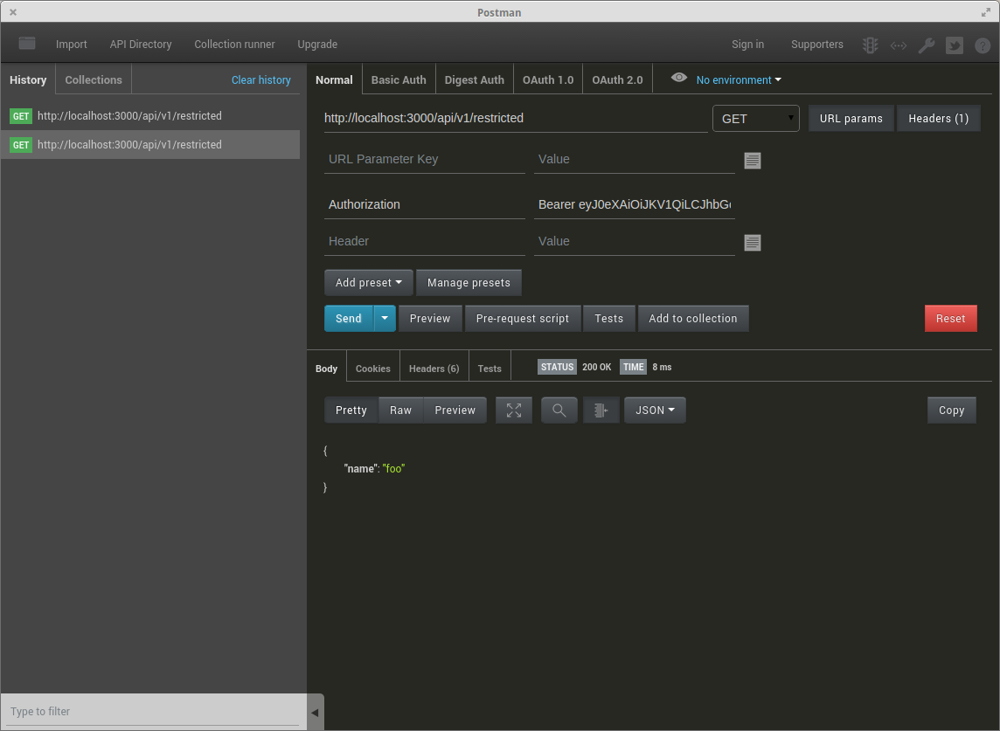

# JWT #

- Web site: [https://jwt.io](https://jwt.io)

- JSON Web Token (JWT) อ่านออกเสียงว่า JOT

- ประกอบด้วย 3 ส่วน แบ่งด้วย dots (.) -> xxxxx.yyyyy.zzzzz
  - **header** (xxxxx)เป็นส่วนที่บอกว่าเป็นชนิดอะไร (`typ`) และมี hashing algorithm (`alg`)เป็นอะไร เช่น HMAC SHA256 หรือ RSA แล้วเอามาเข้ารหัสแบบ Base64 เอาไว้ _(Base64 decode กลับได้)_

  ```json
  {
    "typ": "JWT",
    "alg": "HS256"
  }
  ```    
  - **payload** (yyyyy) เป็นส่วนที่เอาไว้เก็บ claims (read-only signed claims แก้ไขไม่ได้ ถ้าแก้ token จะ invalid) ซึ่งคือส่วนของข้อมูลทั่วไป หรือข้อมูล user จะมีอยู่ 3 ประเภท คือ reserved, public, and private claims แล้วเอามาเข้ารหัสแบบ Base64 เอาไว้ _(Base64 decode กลับได้)_

  ```json
  {
    "sub": "1234567890",
    "name": "John Doe",
    "admin": true
  }

  // predefined keys
  - sub (Subject) คือ identifier ของ token นี้ ส่วนใช้ userId
  - iat (Issued At) คือ สร้าง token นี้เมื่อไหร่ รูปแบบ unix timestamp
  - exp (Expiry) คือ token หมดอายุเมื่อไหร่ รูปแบบ unix timestamp
  - iss (Issuer) คือ ใคร้เป็นสร้าง token นี้
  ``` 
    - **signature** (zzzzz) เป็นการเอา encoded header, encoded payload และ secret มาเข้ารหัสด้วย algorithm ที่ระบุอยู่ใน header

  ```javascript
  HMACSHA256(
    base64UrlEncode(header) + "." +   
    base64UrlEncode(payload),   
    secret
  )

  ```
  - สุดท้ายเอาทั้ง 3 ส่วนมาต่อกัน `HEADER.PAYLOAD.SIGNATURE` ก็จะได้ JWT
  ```
  eyJhbGciOiJIUzI1NiIsInR5cCI6IkpXVCJ9.
  eyJzdWIiOiIxMjM0NTY3ODkwIiwibmFtZSI6IkpvaG4gRG9lIiwiYWRtaW4iOnRydWV9.
  TJVA95OrM7E2cBab30RMHrHDcEfxjoYZgeFONFh7HgQ  
  ```

## Package jsonwebtoken ##

Web site: [https://www.npmjs.com/package/jsonwebtoken](https://www.npmjs.com/package/jsonwebtoken)

Installation: `$ npm install jsonwebtoken --save`

Usage: 

สร้าง token ใช้ **`jwt.sign(payload, secretOrPrivateKey, options, [callback])`**

```javascript

// sign with default (HMAC SHA256) 
var jwt = require('jsonwebtoken');
var token = jwt.sign({ foo: 'bar' }, 'shhhhh');
//backdate a jwt 30 seconds 
var older_token = jwt.sign({ foo: 'bar', iat: Math.floor(Date.now() / 1000) - 30 }, 'shhhhh');
 
// sign with RSA SHA256 
var cert = fs.readFileSync('private.key');  // get private key 
var token = jwt.sign({ foo: 'bar' }, cert, { algorithm: 'RS256'});
 
// sign asynchronously 
jwt.sign({ foo: 'bar' }, cert, { algorithm: 'RS256' }, function(err, token) {
  console.log(token);
});
```


การดึงค่าออกมาจาก token ใช้ **`jwt.verify(token, secretOrPublicKey, [options, callback])`**

```javascript

// verify a token symmetric - synchronous 
var decoded = jwt.verify(token, 'shhhhh');
console.log(decoded.foo) // bar 
 
// verify a token symmetric 
jwt.verify(token, 'shhhhh', function(err, decoded) {
  console.log(decoded.foo) // bar 
});
 
// invalid token - synchronous 
try {
  var decoded = jwt.verify(token, 'wrong-secret');
} catch(err) {
  // err 
}
 
// invalid token 
jwt.verify(token, 'wrong-secret', function(err, decoded) {
  // err 
  // decoded undefined 
});
 
// verify a token asymmetric 
var cert = fs.readFileSync('public.pem');  // get public key 
jwt.verify(token, cert, function(err, decoded) {
  console.log(decoded.foo) // bar 
});
 
// verify audience 
var cert = fs.readFileSync('public.pem');  // get public key 
jwt.verify(token, cert, { audience: 'urn:foo' }, function(err, decoded) {
  // if audience mismatch, err == invalid audience 
});
 
// verify issuer 
var cert = fs.readFileSync('public.pem');  // get public key 
jwt.verify(token, cert, { audience: 'urn:foo', issuer: 'urn:issuer' }, function(err, decoded) {
  // if issuer mismatch, err == invalid issuer 
});
 
// verify jwt id 
var cert = fs.readFileSync('public.pem');  // get public key 
jwt.verify(token, cert, { audience: 'urn:foo', issuer: 'urn:issuer', jwtid: 'jwtid' }, function(err, decoded) {
  // if jwt id mismatch, err == invalid jwt id 
});
 
// verify subject 
var cert = fs.readFileSync('public.pem');  // get public key 
jwt.verify(token, cert, { audience: 'urn:foo', issuer: 'urn:issuer', jwtid: 'jwtid', subject: 'subject' }, function(err, decoded) {
  // if subject mismatch, err == invalid subject 
});
 
// alg mismatch 
var cert = fs.readFileSync('public.pem'); // get public key 
jwt.verify(token, cert, { algorithms: ['RS256'] }, function (err, payload) {
  // if token alg != RS256,  err == invalid signature 
});
```

## Request Header ##
- ให้ส่งไปใน `Authorization: Bearer TOKEN_STRING`
- ตัวอย่าง
