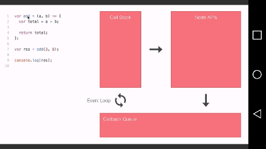
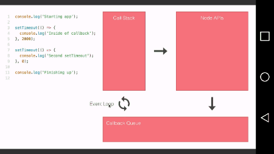
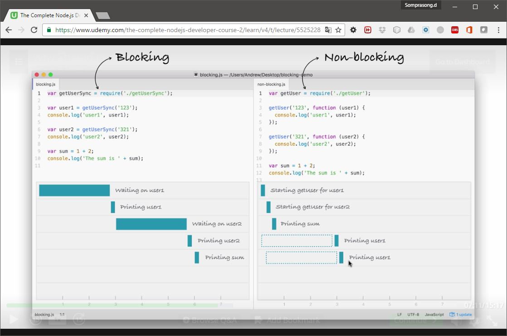

# Node.js #

Last Updated: 25/05/2017

## ทบทวนเนื้อหา JavaScript ##
[JavaScript](../JavaScript/01-JavaScript)

## ติดตั้ง Node.js ##

1. Install Node.js ดาวน์โหลด ณ ตอนนี้ใช้ [Node.js v7.10.0](https://nodejs.org/en/)
2. เปิด CMD/Terminal ทดสอบรันคำสั่ง `node -v` และ `npm -v`

## Text Editor ##
- [ATOM](https://atom.io/)
- [Vistual Studio Code](https://code.visualstudio.com/) ใช้ตัวนี้
- [Netbeans](https://netbeans.org/)

## Node.js คืออะไร ##

Node.js คือ JavaScript runtime ที่สร้างมาจาก Chrome's V8 JavaScript engine โดยหัวใจสำคัญคือการใช้ event-driven กับ non-blocking I/O

- มี npm (Node Package Manager) ไว้ติดตั้ง module ต่างๆ ใน Node.js package ecosystem มาใช้งานได้
- เปรียบเทียบ Object ใน Google Chrome กับ Node.js

Object | GG Chrome | Node.js
------------ | ------------ | -------------
Global Object | window | global
DOM Object | document | ไม่มี
Process Object | ไม่มี | process

## REPL (Read-Evel-Print-Loop) ##
- Node.js สามารถรันแบบ REPL โหมดได้ คือ มันไม่ต้อง complie โค้ด สามารถรันได้เลย
- เข้าโหมด REPL โดยพิมพ์ `$ node`
- REPL
  - R - read คือ รับ input จาก keyboard
  - E - eval คือ สามารถประมวลผลโค้ดที่รับมาได้ทันที
  - P - print คือ แสดงผลลัพธ์ออกมาได่เลย
  - L - Loop คือ เริ่มกลับไปทำงาน 3 ขั้นตอนข้างบนใหม่ จนกว่าจะจบการทำงาน
- ตัวอย่าง
```bash
$ node
> 10 + 30
40
> 50 * (10 - 3) / 3
100
> a = 120
120
> b = 200
200
> c = 300
300
> a + b + c
620
> total = _
620
> console.log(total)
620
undefined
>
```


## การทำงานของ Call Stack & Event Loop ##






ภาพจาก [The Complete Node.js Developer Course 2.0 | Udemy](https://www.udemy.com/the-complete-nodejs-developer-course-2/learn/v4/t/lecture/5525228)

## การทำงานแบบ Non-Blocking I/O ##
- มีการทำงานแบบ Asynchronous Task คือไม่ต้องรอทำงานทีละบรรทัด 
- ภาพตัวอย่างเปรียบเทียบการทำงานแบบ synchronouse Vs. Asynchronous

ภาพจาก [The Complete Node.js Developer Course 2.0 | Udemy](https://www.udemy.com/the-complete-nodejs-developer-course-2/learn/v4/t/lecture/5525228)
- วิธีการเขียนโค้ดแบบ Asynchronous ทำได้ดังนี้
1.  [Callback Function](../JavaScript/01-JavaScript/02-Advanced/Callback%20Function) คือเมื่อทำงานเสร็จแล้วให้เรียกฟังก์ชัน callback ให้ทำงานต่อ จัดการไม่ดีอาจมีปัญหาเรื่อง [Callback Hell](http://callbackhell.com/)
2.  [Promise](../JavaScript/01-JavaScript/02-Advanced/Promise) ES2015 เพิ่ม Promise มาดักจับการทำงานถ้าสำเร็จให้ทำอะไร ไม่สำเร็จให้ทำอะไร
3.  [Async/Await](../JavaScript/01-JavaScript/02-Advanced/Async%20%26%20Await) ES2017 เพิ่ม async/await มาใช้ร่วมกับ Promise เพื่อหยุดรอให้ Promise ทำงานให้เสร็จ (ทำให้ async ดูเหมือน sync)

## Node Module ##

ใช้ require ในการเรียกใช้งาน module อื่น ในโค้ดของเรา เช่น `const fs = require('fs');`

โดยจะมี module อยู่ 4 ประเภท ดังนี้

1. **Core Module** ใช้ `require('module name');` จะเป็น module ที่มีมาใน Node.js เลย ดูว่ามีอะไรให้ใช้บ้างจาก [Doc](https://nodejs.org/api/)
    ```javascript
	const fs = require('fs');

	fs.appendFile('greetings.txt', 'Hello World!');
    ```
    [ตัวอย่างการใช้ Core Module](./Core-Modules)
    
2. **File Module** เป็น module ที่่สร้างขึ้นมาเองเอง ใช้ `require('./notes');` ต้องระบุตำแหน่งของไฟล์ (ถ้าไม่ใส่นามสกุลไฟล์ `require()` จะไปถ้าที่ .js ให้เอง) โดยไฟล์ notes.js ต้องมี `module.exports` หรือ `exports` ด้วย

3. **Folder Module** จะระบุ path ไปยังโฟลเดอร์ที่มีไฟล์ package.json เช่น `var say = require('./module');`

4. **Third-party Module** เป็น module ที่ติดตั้งผ่าน npm โดยใช้ `npm install [module name] [options]` และเรียกใช้งานโดย `require('[module name]');` ระบุชื่อไปเลย เหมือน core module
    ```javascript
	const gulp = require('gulp'); // ต้อง npm install gulp --save ก่อน

	gulp.task('default', () => console.log('Hello Gulp Task!'));
    ```

## การสร้าง module (ต้องกลับมาอัพเดทอีกที เผื่อเข้าใจผิดอยู่) ##

ต้องสร้างไฟล์ xxx.js ขึ้นมา และทำการ export ส่วนที่ต้องการให้ใช้งานออกไป ซึ่งสามารถทำได้ 2 วิธี

1. ใช้ `exports.xxx = function(){};`

2. ใช้ `module.exports = {};` หรือ `module.exports.xxx = function(){};`

ซึ่งเมื่อเราเรียกใช้ `require('path/file-module');` ตัว `function require(path);` จะ `return module.exports;` ออกมาให้ และมีการสร้างตัวแปร `var exports = module.exports = {};`


## NPM ##

- เริ่มต้นใช้คำสั่ง `npm init` เพื่อสร้างไฟล์ package.json
- ต้องติดตั้ง module ที่จะใช้งานจาก npm ใช้คำสั่ง `npm install [module name] --save` โดย `--save` คือบอกว่าใช้เฉพาะโปรเจคนี้ และสั่งให้บันทึกลงในไฟล์ package.json ด้วย แต่ถ้าต้องการติดตั้งแบบ global คือต้องการใช้ทุกโปรเจค ให้เปลี่ยนไปใช้ `-g` แทน
- การระบุ version ทำได้โดย `npm install <module_name>@4.2.3` ซึ่งเลขเวอร์ชันจะเป็นแบบ major.minor.patch
- การอัพเดท ใช้ `npm update <module_name>` สามารถใส่ --save หรือ -g ได้
- การลบ ใช้ `npm uninstall <module_name>` สามารถใส่ --save หรือ -g ได้
- การระบุเลขเวอร์ชัน
	- ระบุเลขเวอร์ชันที่ต้องการเลย เช่น `npm install express@4.12.0`
	- ระบุเป็นช่วง <, <=, >, >= เช่น `npm install express@">=4.12.0"`
	- ระบุเป็นช่วง ~ (tilde) ถ้าระบุ minor จะเอา patch สูงสุด ถ้าระบุ major จะเอา minor สูงสุดมา เช่น `npm install express@"~1.2.3"` หมายถึงให้เอาเวอร์ชัน >=1.2.3 แต่ < 1.3.0
	- ระบุช่วง ^ (caret) จะอัพเดทส่วนที่ต่ำกว่า **“หลักซ้ายสุดที่ไม่ใช่ศูนย์”** เช่น `npm install express@"^1.2.3"` หมายถึง >=1.2.3 < 2.0.0 หรือ `npm install express@"^0.2.3"` หมายถึง >=0.2.3 < 0.3.0


## Restarting App with Nodemon ##

ปกติเวลาแก้ไขโค้ดจะต้องรันใหม่ทุกครั้ง เช่น `node app.js` ซึ่งถ้าไม่อยากมานั่งรันไฟล์ใหม่ทุกครั้งที่มีการแก้ไขก็ใช้ module ที่ชื่อ nodemon มาช่วย

- เริ่มจาก `npm install nodemon -g`
- เวลารันไฟล์เปลี่ยนมาเป็น `nodemon app.js` แทน
- การ shutdown nodemon ใช้ `Ctrl + C`

## การใช้งานกับ JSON ##

```javascript
// แปลงจาก Object เป็น JSON
var obj = {
	name: "Somprasong"
};
var strObj = JSON.stringify(obj);

// แปลงจาก JSON เป็น Object
var personStr = '{"name": "Somprasong", "age": 31}';
var person = JSON.parse(personStr);
```

## Config Environment ##
- การกำหนดค่า Environemnt
  - Windows
	- ใช้คำสั่ง $ set KEY=VALUE เช่น `$ set NODE_ENV=production`
  - OS X
	- ใช้คำสั่ง $ env KEY=VALUE เช่น `$ env NODE_ENV=production`

- วิธีการเรียกใช้งานในโค้ด โดยผ่าน object ที่ชื่่อ `process.env` เช่น `if(process.env.NODE_ENV === 'production')`

## Global Objects ##
- `__dirname` จะรีเทิร์น directory ปัจจุบันของไฟล์ที่เรียกใช้ ตัวอย่าง `console.log(__dirname);`
- `__filename` จะรีเทิร์นตำแหน่งปัจจุบันของไฟล์ที่เรียกใช้ ตัวอย่าง `console.log(__filename);`

## Debuging ##

- ใช้คำสั่ง `node debug app.js`

- ถ้าต้องการไป statement ถัดไป พิมพ์ n แล้ว Enter

- ถ้าต้องการจบโปรแกรมเลย พิมพ์ c แล้ว Enter

- ถ้าต้องการออกจาก debug mode ใช้ Ctrl + C หรือ พิมพ์ quit

- ในระหว่าง debug mode ถ้าต้องการเขียนโค้ดเพิ่ม หรือเอาค่าตัวแปรที่ผ่าน debug มาแล้วให้เข้า repl mode โดยพิมพ์ repl แล้ว Enter ถ้าต้องการออกใช้ Ctrl + C

- ถ้าอยากระบตำแหน่งที่ต้องการจะ debug ให้แก้ไขไฟล์ที่จะ debug โดยจะเริ่มที่บรรทัดไหน ใส่ `debugger;` แล้วรันคำสั่ง `node debug app.js` มันจะหยุดที่ statement แรก จากนั้นให้พิมพ์ c แล้ว Enter มันจะพาไปยังบรรทัดที่พิมพ์ `debugger;` ไว้

## Node Version Manager (nvm) for Windows ##
- เนื่องจากบางครั้งเราอาจต้องการทดสอบโค้ดบน Node.js หลายๆ เวอร์ชัน สามารถใช้ nvm ช่วยในการสลับเวอร์ชันของ Node.js ที่จะรันได้
- [nvm for Windows](https://github.com/coreybutler/nvm-windows)
- วิธีใช้เบื้องต้น
  - `nvm ls` เพื่อดูว่าติดตั้งเวอร์ชันอะไรไว้บ้าง โดยตัวที่กำลังใช้งานอยู่จะมี "*" อยู่ข้างหน้า
  - `nvm install 6.10.2` ใช้สำหรับติดตั้ง Node.js เวอร์ชันที่ต้องการ
  - `nvm use 6.10.2` ใช้สำหรับสลับไปใช้งานเวอร์ชัน 6.10.2
  - ลองตรวจสอบด้วย `node -v`

## อื่นๆ ##

- การสร้าง Web Server โดยใช้ [Express](./Express)
- การทดสอบระบบโดยใช้ [Mocha](./Mocha)
- ใช้ [MongoDB](../Database/MongoDB) โดย [Mongoose](./Mongoose) ORM
- Security and Authentication โดยใช้ [JWT](./JWT)
- แนะนำ package [validator](https://www.npmjs.com/package/validator) ซึ่ง  library สำหรับ string validators และ sanitizers เอามาใช้ร่วมกับการสร้าง schema ของ mongoose ได้
- ใช้ package [lodash](https://www.npmjs.com/package/lodash) `_.pick(object, [paths])` ช่วยในการสร้าง object ใหม่ โดยการเลือก field ออกมาจาก object เดิม เช่น `var body = _.pick(req.body, ['email', 'password']);`
- ใช้ package [moment](http://momentjs.com/docs/) จัดการเรื่อง date format
- ตัวอย่างการใช้ [socket.io](https://github.com/somprasongd/node-chat-app)
