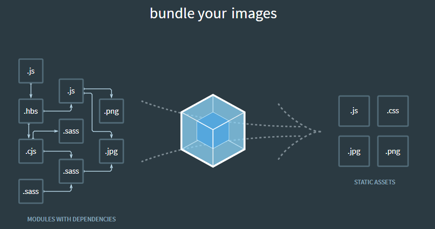

# webpack 4

## webpack คือ



## เริ่มต้นใช้งาน

แบ่งโครงสร้าง project เป็น

```
root
----/dist
--------/index.html
----/src
-------/index.js
----/package.js
----/webpack.config.js
```

- ติดตั้ง webpack `npm install -D webpack-cli webpack`
- สร้างไฟล์ index.html
```html
<!DOCTYPE html>
<html lang="en">
<head>
  <title>Webpack 2</title>
</head>
<body>  
  <script src="bundle.js"></script>
</body>
</html>
```

- สร้างไฟล์ index.js
```javascript
console.log('Hello from webpack!!!');
```

- สร้างไฟล์ webpack.config.js เพื่อให้รวมไฟล์จาก src/index.js ไปเป็น dist/bundle.js
```javascript
const path = require('path');

module.exports = {
  entry: './src/index.js',
  output: {
    filename: 'bundle.js',
    path: path.resolve(__dirname, 'dist')
  }
};
```

- แก้ไขไฟล์ package.json เพื่อสั่งรัน webpack
```json
"scripts": {
  "build": "webpack"
}
```

- ทดสอบ `npm run build`

## การใช้ webpack loader

### Load CSS
โดยใช้ css loader

- ติดตั้ง `npm i -D style-loader css-loader`
- แก้ไขไฟล์ webpack.config.js โดยเพิ่ม modules เพื่อบอกว่าทุกไฟล์ที่ลงท้ายด้วย .css ให้ใช้ style-loader, css-loader
```javascript
const path = require('path');

module.exports = {
  entry: './src/index.js',
  output: {
    filename: 'bundle.js',
    path: path.resolve(__dirname, 'dist')
  },
  module: {
    rules: [
      {
        test: /\.css$/,
        use: [
          'style-loader',
          'css-loader'
        ]
      }
    ]
  }
};

```

- สร้างไฟล์ src/css/main.css
```css
body {
  background: red
}
```

- เรียกใช้งาน main.css
```javascript
import './css/main.css';

console.log('Hello from webpack!!!');
```

- ทดสอบ `npm run build`

### Load SCSS
โดยใช้ sass loader

- ติดตั้ง `npm i -D sass-loader node-sass`
- แก้ไขไฟล์ webpack.config.js ทุกไฟล์ที่ลงท้ายด้วย .scss ให้ใช้ style-loader, css-loader, sass-loader
```javascript
const path = require('path');

module.exports = {
  entry: './src/index.js',
  output: {
    filename: 'bundle.js',
    path: path.resolve(__dirname, 'dist')
  },
  module: {
    rules: [
      {
        test: /\.css$/,
        use: [
          'style-loader',
          'css-loader'
        ]
      },
      {
        test: /\.scss$/,
        use: [
          {loader: 'style-loader'},
          {loader: 'css-loader'},
          {loader: 'sass-loader'}
        ]
      }
    ]
  }
};

```

- สร้างไฟล์ src/scss/main.scss
```scss
$blue: blue;

body {
  background: $blue;
}
```

- เรียกใช้งาน main.scss
```javascript
import './scss/main.scss';

console.log('Hello from webpack!!!');
```

- ทดสอบ `npm run build`

### ใช้งานร่วมกับ babel
เพื่อให้แปลง es6 เป็น es5

- ติดตั้ง babel `npm i -D babel-loader babel-core babel-preset-env`
- แก้ไขไฟล์ webpack.config.js ทุกไฟล์ที่ลงท้ายด้วย .scss ให้ใช้ style-loader, css-loader, sass-loader
```javascript
const path = require('path');

module.exports = {
  entry: './src/index.js',
  output: {
    filename: 'bundle.js',
    path: path.resolve(__dirname, 'dist')
  },
  module: {
    rules: [
      {
        test: /\.css$/,
        use: [
          'style-loader',
          'css-loader'
        ]
      },
      {
        test: /\.scss$/,
        use: [
          {loader: 'style-loader'},
          {loader: 'css-loader'},
          {loader: 'sass-loader'}
        ]
      },
      {
        test: /\.js$/,
        exclude: /node_modules/,
        loader: 'babel-loader'
      }
    ]
  }
};

```

- สร้างไฟล์ .babelrc
```json
{
  "presets": [
    "env"
  ]
}
```

- สร้างไฟล์ src/js/module.js
```javascript
export function greeting() {
  console.log('Hello from JS module');
}

export function greeting2() {
  console.log('Hello from JS module 2');
}
```

- เรียกใช้งาน module.js
```javascript
import './scss/main.scss';
import {greeting, greeting2} from './js/module'

console.log('Hello from webpack!!!');

greeting();
greeting2();
```

- ทดสอบ `npm run build`
- ลองดูใน console จะแสดง
```
Hello from webpack!!!
Hello from JS module
Hello from JS module 2
```

## Webpack --watch
เพื่อความสะดวกในการพัฒนา ไม่ต้องมาสั่ง `npm run build` ทุกครั้ง ก็สามารถใช้คำสั่ง `webpack --watch` ได้ ซึ่งเมื่อแก้ไข และบันทึกไฟล์ webpack ก็จะทำงานโดยอัตโนมัติ แต่ให้ไปใส่ไว้ใน package.json แทน
```json
"scripts": {
    "build": "webpack",
    "watch": "webpack --watch"
  },
```

- ทดสอบ `npm run watch`
- ลองแก้ไขไฟล์ src/js/module.js
```javascript
export function greeting() {
  console.log('Hello from JS module');
}

export function greeting2() {
  console.log('Hello from JS module ^^^^^^^^');
}
```

- ลองดูใน console จะแสดง
```
Hello from webpack!!!
Hello from JS module
Hello from JS module ^^^^^^^^
```

## การแยก CSS ออกจาก bundle.js

- ต้องลง plugin เพิ่ม `npm i -D extract-text-webpack-plugin`
- แก้ไขไฟล์ webpack.config.js
- ดูจาก [extract-text-webpack-plugin](https://github.com/webpack-contrib/extract-text-webpack-plugin)
- ใน webpack 4 บอกว่า css ใช้ตัวนี้
[mini-css-extract-plugin](https://github.com/webpack-contrib/mini-css-extract-plugin)
 ### ข้ามไปก่อน

 ## เปิดใช้งาน sourcemaps
 ให้เพิ่ม `devtool: 'cheap-module-eval-source-map',` ใน webpack.config.js
```javascript
module.exports = {
  entry: './src/index.js',
  output: {
    filename: 'bundle.js',
    path: path.resolve(__dirname, 'dist')
  },
  devtool: 'cheap-module-eval-source-map',
};
```
- ทดสอบดูใน console คราวนี้จะบอกว่ามาจากไฟล์ไหน และสามารถกดเข้าไปดูโค้ดได้
```
index.js:5 Hello from webpack!!!
module.js:2 Hello from JS module
module.js:6 Hello from JS module ^^^^^^^^
```

## การสร้าง bundle หลายๆ ไฟล์
- สมมุติว่ามีไฟล์
```
/src
..../index.js
..../about.js
```
- และต้องการจะสร้าง bundle.js แยก ต้องไปแก้ที่ webpack.config.js ดังนี้
```javascript
module.exports = {
  entry: {
    app: './src/index.js',
    about: './src/about.js'
  },
  output: {
    filename: '[name].bundle.js',
    path: path.resolve(__dirname, 'dist')
  },
  devtool: 'inline-source-map',
};
```

- เมื่อรัน `npm run build` จะได้ไฟล์ดังนี้
```
/dist
..../app.bundle.js
..../about.bundle.js
```

## ใช้ plugin html

คือเราไม่ต้องสร้างไฟล์ dist/index.html เอาไว้ก่อนแล้ว โดยไฟล์นี้จะถูกสร้างใหม่ทุกครั้งที่รัน `npm run build` และจะทำการเรียกไฟล์ที่เราต้องใช้งานให้อัตโนมัติ
- ติดตั้ง `npm i -D html-webpack-plugin`
- แก้ไฟล์ webpack.config.js
```javascript
const HTMLWebpackPlugin = require('html-webpack-plugin');

module.exports = {
  entry: './src/index.js',
  output: {
    filename: 'bundle.js',
    path: path.resolve(__dirname, 'dist')
  },
  plugins: [
    // ถ้ามีใช้ plugin css ก่อนให้เอาไว้ด้านล่าง plugin css
    new HTMLWebpackPlugin({
      title: 'Multiple Bundles!'
    })
  ]
};
```

- แต่แนะนำให้ลบ dist ก่อน เสมอ โดยติดตั้ง `npm i -D clean-webpack-plugin` และแก้ไขไฟล์ webpack.config.js ดังนี้
```javascript
const HTMLWebpackPlugin = require('html-webpack-plugin');
const CleanWebpackPlugin = require('clean-webpack-plugin');

module.exports = {
  entry: './src/index.js',
  output: {
    filename: 'bundle.js',
    path: path.resolve(__dirname, 'dist')
  },
  plugins: [
    new CleanWebpackPlugin([
      'dist' // directory ที่จะลบ
    ]),
    new HTMLWebpackPlugin({
      title: 'Multiple Bundles!'
    })
  ]
};
```

### ถ้าต้องการสร้าง template เอง ทำได้โดย
กรณีที่ต้องการสร้าง template index.html เอง แล้วให้ webpack ใส่ bundle.js หรือ css มาให้ ทำได้โดย
- สร้างไฟล์ /src/index.html
```html
<!DOCTYPE html>
<html lang="en">
<head>  
  <title>Index html</title>
</head>
<body>
  <script
  src="https://code.jquery.com/jquery-3.3.1.min.js"
  integrity="sha256-FgpCb/KJQlLNfOu91ta32o/NMZxltwRo8QtmkMRdAu8="
  crossorigin="anonymous"></script>
</body>
</html>
```

- แก้ไฟล์ webpack.config.js ใน plugins

```javascript
new HTMLWebpackPlugin({
      filename: 'index.html',
      template: 'src/index.html',
      minify: !devMode
    })
```

## Webpack Dev Server

- ติดตั้ง `npm i -D webpack-dev-server`
- แก้ไขไฟล์ webpack.config.js
```javascript
devServer: {
    contentBase: path.join(__dirname, "dist"), // Tell the server where to serve content from
    compress: true, // Enable gzip compression for everything served
    port: 8080, // Specify a port number to listen for requests on
    host: "0.0.0.0" // By default this is localhost. If you want your server to be accessible externally, specify it like this
  }
```

- แก้ไขไฟล์ package.json
```json
"scripts": {
    "build": "webpack",
    "watch": "webpack --watch",
    "dev": "webpack-dev-server"
  }
```